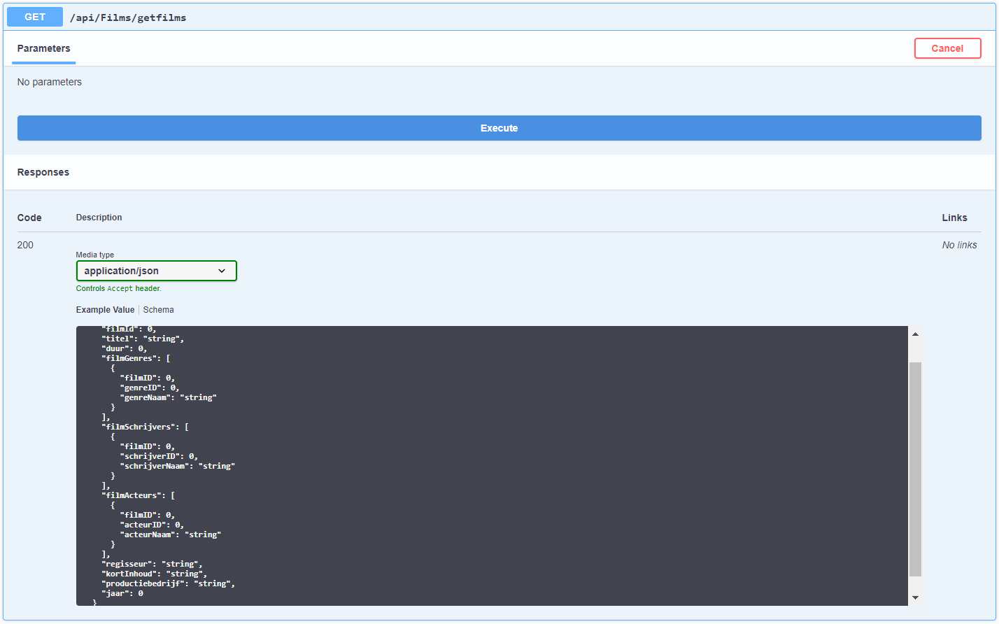
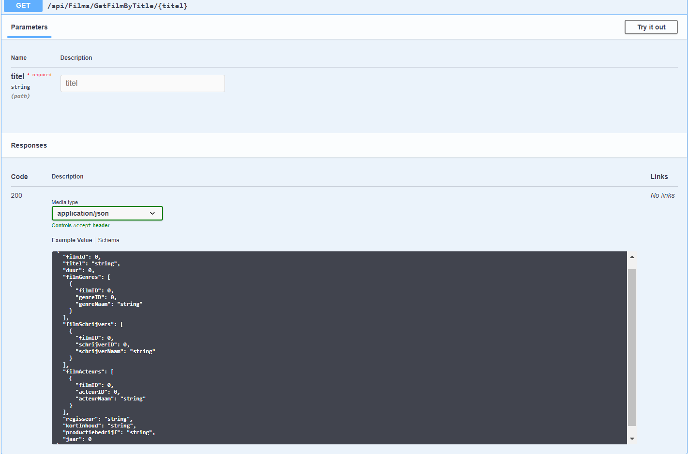
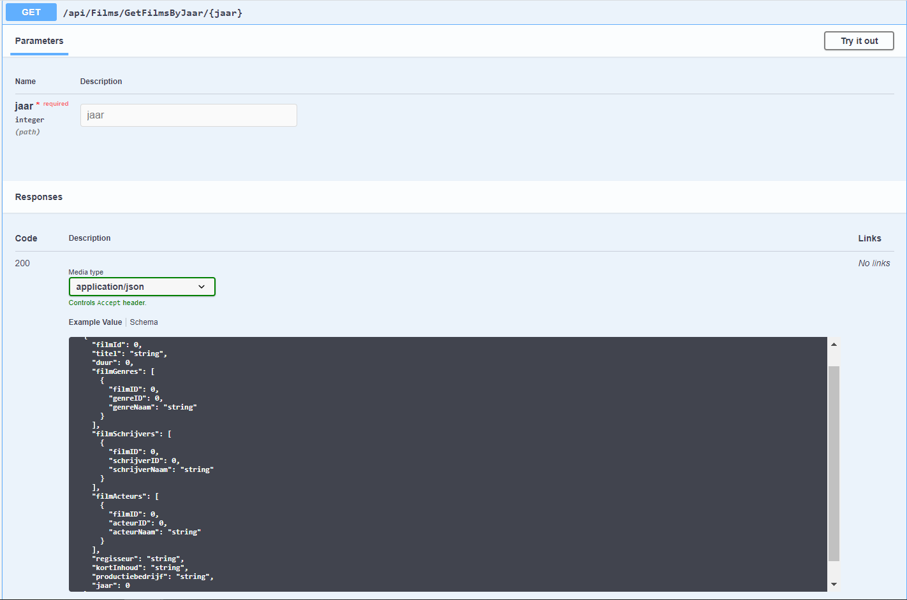
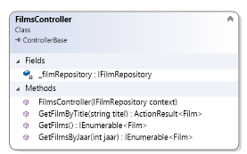

## web4-1920-b1-be-AudreyBehiels
# Webapplicatie_IV Backend Audrey Behiels

# screenshots van de API
Film API Swagger

GET api/Films/GetFilms

GET api/Films/GetFilmsByTitel/{titel}

GET api/Films/GetFilmsByJaar/{jaar}

# screenshots Klassendiagram

# de readme
- [x] Printscreen van de API zoals weergegeven in swagger. Per endpoint een printscreen van de parameters en de responses
- [x] Printscreen van het klassendiagram van de domeinlaag (toont de klassen met properties en methodes (inclusief de datatypes) en de associaties)
- [x] Opsomming van de instellingen die nodig zijn om je backend project lokaal te runnen, indien nodig
- [ ] Voorbereiding feedback moment:

# Domein laag
- [x] Het domein bevat minstens 2 geassocieerde klassen
- [x] Klassen bevatten toestand en gedrag
- [x] Klassendiagram is aangemaakt, toont de properties, methodes en de associaties

# Data laag
- [x] DataContext is aangemaakt
- [x] Mapping is geïmplementeerd (a.d.h.v. Mapper klassen)
- [x] Databank wordt geseed met data (via initializer)

# Controller
- [x] Minstens 1 controller met endpoints voor de CRUD operaties
- [ ] De endpoints zijn gedefinieerd volgens de best practices
- [ ] Enkel de benodigde data wordt uitgewisseld (DTO’s indien nodig)

# Swagger
- [x] De documentatie is opgesteld
